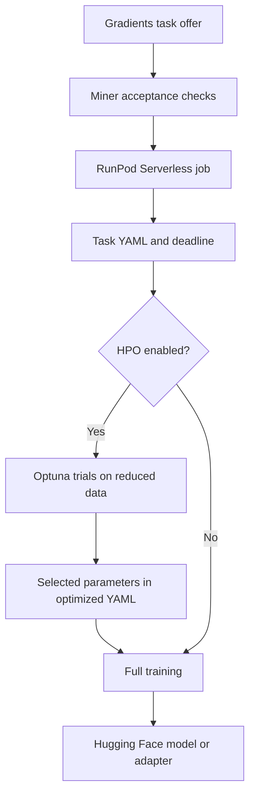

# RunPod LLM Fine-Tuning for Gradients

A GPU training worker and miner integration for the **Bittensor Gradients subnet**, supporting supervised fine-tuning (SFT), direct preference optimization (DPO), and group relative policy optimization (GRPO) of open-weight language models.

Each task supplies a base model, dataset, and completion deadline. The engineering challenge is to spend that limited GPU time effectively: prepare the data, compare training configurations, train with the selected parameters, and publish the resulting model to Hugging Face. SFT and DPO tasks seek lower evaluation loss; the Gradients GRPO task convention used here seeks higher evaluation loss.

The repository contains the RunPod worker, training pipeline, and an adapter for the external Gradients miner runtime. It is an implementation snapshot with deployment and HPO gaps documented below.

## Engineering focus

- **Training under a time budget.** An Optuna search is designed to use a portion of the remaining task time before handing its selected parameters to a full training run. A training callback stops at a step boundary as the deadline approaches.
- **Multiple post-training objectives.** A shared configuration and execution path selects TRL's SFT, DPO, or GRPO trainer, with task-specific data mappings and hyperparameters.
- **GPU memory management.** BF16 model loading, LoRA, gradient checkpointing, gradient accumulation, automatic batch-size discovery, and bitsandbytes optimizers provide controls over memory use. FlashAttention 2 is attempted during model loading, with a fallback; Liger kernels are configurable.
- **Data preparation.** Task-specific JSON loaders normalize columns, remove duplicates based on the training fields, and create validation splits with a fixed seed. HPO trials use smaller, consistently sampled datasets.
- **Experiment-to-artifact workflow.** YAML configurations, SQLite-backed Optuna studies, W&B metrics, and Hugging Face uploads connect experiment selection to a model submission.

Model weights are loaded in BF16. The 8-bit optimizer settings apply to optimizer state.

## Pipeline



The miner adapter checks task type, model size and family, available workers, and whether a task has already been accepted. The worker converts the requested hours into an absolute deadline, generates a task configuration, and calls the training pipeline directly in the worker process.

Full training uses periodic evaluation, checkpoint selection, early stopping, and a wall-clock callback. HPO trials suppress Hub uploads; non-HPO runs publish through the trainer. LoRA runs publish adapters, while full-parameter runs publish model weights.

## Training modes

| Mode | Dataset fields after normalization | Trainer | Selection direction in this code |
| --- | --- | --- | --- |
| SFT | `prompt`, `completion`; optional input appended to the prompt | `SFTTrainer` | Minimize `eval_loss` |
| DPO | `prompt`, `chosen`, `rejected` | `DPOTrainer` | Minimize `eval_loss` |
| GRPO | `prompt`, with task-provided reward functions and weights | `GRPOTrainer` | Maximize `eval_loss` |

GRPO uses the `dr_grpo` loss and masks truncated completions. Reward-function source is written to a task-specific Python module and imported during trainer construction. These jobs execute supplied Python code and require a trusted task source. Reward functions drive training; configuration selection uses `eval_loss` under this project's subnet convention.

## Hyperparameter search

The search in [training/hpo_optuna.py](training/hpo_optuna.py) has the following defaults:

| Setting | Default |
| --- | --- |
| Search allocation | 25% of time remaining before the task deadline |
| Maximum new trials per invocation | 15 |
| Training steps per trial | 100 |
| Evaluation interval | Every 25 steps |
| Per-trial deadline | 45 minutes |
| Trial data | 2% of each split, clamped to 1,000–6,000 examples and capped at the split size |
| Study storage | SQLite, loading an existing study with the same task ID |

The allocation is a soft budget: Optuna's timeout does not interrupt a trial already running. Each trainer reserves 5% of the time remaining at trainer construction and checks the clock every ten steps. Loading, evaluation, and upload time can still extend total execution; this is not a strict deadline guarantee.

The optimizer is fixed to `lion_8bit` during search. Other parameters vary by task:

| Mode | Learning rate, sampled logarithmically | Other searched parameters |
| --- | --- | --- |
| SFT | `1e-6`–`5e-5` | Weight decay `0`–`0.15`, NEFTune on/off |
| DPO | `1e-7`–`1e-5` | Weight decay `0`–`0.05`, beta `0.01`–`0.5`, label smoothing `0`–`0.2` |
| GRPO | `1e-7`–`1e-5` | Weight decay `0`–`0.05`, beta `0.01`–`0.1` |

Models above 12B parameters use LoRA. For smaller models, the search can compare LoRA with full-parameter tuning, with a full-tuning exception for Bloomz. LoRA rank and alpha range from 16 to 1,024 in increments of 16; dropout ranges from `0` to `0.1`.

The selected parameters are merged into a sibling `*_opt.yml` configuration and passed to full training. **The current HPO result-extraction bug must be repaired before this path can complete; see the deployment notes below.**

## Repository guide

| Path | Responsibility |
| --- | --- |
| [tuning.py](tuning.py) | FastAPI miner routes, offer acceptance, RunPod submission, and submission lookup; depends on the external `core` and `fiber` packages |
| [runpod_handler.py](runpod_handler.py) | Serverless entry point, CPU thread allocation, deadline creation, configuration setup, and pipeline invocation |
| [serverless.dockerfile](serverless.dockerfile) | CUDA/PyTorch worker image, training dependencies, runtime authentication, and worker startup |
| [configs/base.yml](configs/base.yml) | Shared training configuration template |
| [configs/serverless_config_handler.py](configs/serverless_config_handler.py) | Request deserialization, model metadata, dataset mappings, task YAML, and GRPO reward modules |
| [training/hpo_optuna.py](training/hpo_optuna.py) | Search space, study persistence, trial execution, and optimized-config handoff |
| [training/train.py](training/train.py) | Shared model/data setup and SFT, DPO, or GRPO training |
| [training_helpers/dataset_helpers.py](training_helpers/dataset_helpers.py) | Tokenizer setup, column normalization, deduplication, and validation splits |
| [training_helpers/model_helpers.py](training_helpers/model_helpers.py) | BF16 model loading, attention fallback, and LoRA target selection |
| [training_helpers/trainer_helpers.py](training_helpers/trainer_helpers.py) | Trainer arguments and dynamic reward-function loading |
| [training_helpers/custom_callbacks.py](training_helpers/custom_callbacks.py) | Wall-clock stopping callback |

## Deployment

### Requirements

- An NVIDIA GPU compatible with the image's CUDA 12.8 / PyTorch 2.7.0 stack and BF16 training, with sufficient memory for the selected model and tuning mode.
- Docker and a RunPod Serverless endpoint for the worker image.
- Hugging Face model access and permission to write the submission repository.
- A W&B account for the worker's configured authentication and experiment reporting.
- A JSON or JSONL dataset available inside the worker or at a location supported by the JSON loader.
- The Gradients miner runtime when using `tuning.py`; its `core` and `fiber` dependencies are not included here.

### Prepare the worker

Supply credentials through the RunPod endpoint's runtime secrets. Keep real values out of source files, Docker build arguments, and image `ENV` instructions. [`.env.example`](.env.example) lists the variables without credentials; a local `.env` is excluded from Git and Docker build context. Rotate previously exposed credentials before deploying a rebuilt image, and retire images built with the old credentials. Configure the following runtime variables:

| Variable | Purpose |
| --- | --- |
| `HUGGINGFACE_TOKEN` | Worker login, gated-model access, and model uploads |
| `HUGGINGFACE_USERNAME` | Namespace for the generated submission repository |
| `WANDB_TOKEN` | Worker login to W&B |
| `WANDB_PROJECT` | Optional base project name for HPO reporting |
| `PYTHONPATH` | Set to `/workspace:/workspace/training` for the current image layout so the worker can import the training helpers |
| `AWS_ACCESS_KEY_ID`, `AWS_SECRET_ACCESS_KEY` | Optional runtime credentials for private S3 or Cloudflare R2 datasets |
| `AWS_ENDPOINT_URL` | Runtime endpoint URL when using an S3-compatible storage service such as R2 |
| `AWS_DEFAULT_REGION` | Storage region, defaulting to `us-east-1` in the image |
| `AWS_SESSION_TOKEN` | Runtime session token when using temporary AWS credentials |

Build the worker image:

```bash
docker build -f serverless.dockerfile -t runpod-finetuning .
```

Publish the image to your container registry and configure a RunPod Serverless endpoint to use it. For miner integration, set `ENDPOINT_API_KEY` in the miner environment, replace the hard-coded RunPod endpoint ID in `tuning.py`, and keep `MAX_NUM_WORKERS` consistent with the endpoint's worker limit.

### Example SFT request

This is a RunPod API request body. Replace the model ID and provision the dataset at the indicated worker path. `hpo: false` bypasses the current HPO scoring bug; enable it after repairing result extraction.

```json
{
  "input": {
    "task_id": "example-sft",
    "model": "<hugging-face-model-id>",
    "dataset": "/workspace/input_data/train.jsonl",
    "dataset_type": {
      "class_type": "InstructTextDatasetType",
      "attributes": {
        "field_instruction": "instruction",
        "field_input": "input",
        "field_output": "output"
      }
    },
    "file_format": "json",
    "expected_repo_name": "example-sft-adapter",
    "hours_to_complete": 2,
    "hpo": false,
    "testing": false
  }
}
```

Each dataset record should contain the mapped fields, for example:

```json
{"instruction": "Explain gradient accumulation.", "input": "", "output": "It combines gradients from several smaller batches before updating the model."}
```

Supply enough records for training and validation. DPO requests use `DpoDatasetType` with `field_prompt`, `field_chosen`, and `field_rejected`. GRPO requests use `GrpoDatasetType` with `field_prompt` and `reward_functions`, each containing Python source in `reward_func` and a nonnegative `reward_weight`.

The default configuration creates a 5% validation split. Keep a positive validation fraction: the current training path enables evaluation and the HPO subset logic expects an evaluation dataset.

### Run from a generated configuration

Inside a prepared worker environment, these entry points accept a populated task YAML:

```bash
PYTHONPATH=/workspace:/workspace/training python -m training.hpo_optuna --config /workspace/configs/example-sft.yml
PYTHONPATH=/workspace:/workspace/training python -m training.train --config /workspace/configs/example-sft.yml
```

The first runs the pipeline, respecting `do_hpo`; the second runs training directly. `configs/base.yml` is a template and needs task-specific model, dataset, deadline, and Hub settings before either command can use it.

## Outputs

- **Task configurations:** `/workspace/configs/<task_id>.yml` and, after successful search, `<task_id>_opt.yml`.
- **Optuna studies:** `./hpo_runs/<task_id>/hpo.db` by default, relative to the working directory. Existing studies load automatically.
- **Trial artifacts:** `./hpo_runs/trial<number>/` by default. These paths are shared across tasks, so isolate them when running concurrent pipelines in the same workspace.
- **Training checkpoints:** The configured `output_dir`, defaulting to `training_output`.
- **Published artifact:** `<HUGGINGFACE_USERNAME>/<expected_repo_name>`.
- **Worker response:** Task ID, success status, repository name, and completion timestamp, or an error for failures caught by the pipeline handler. Detailed logs remain in the worker logs and W&B.

## Current limitations and validation

- **HPO scoring needs repair.** `loss_from_state` is referenced but not defined. Its intended trainer-state extraction code sits after an unconditional return inside `loss_from_wandb`, so the result-extraction path raises `NameError`.
- **Pruning is not wired to training.** A Hyperband pruner is configured, but the training callbacks do not report intermediate values to Optuna or request pruning.
- **Uploads can include partial runs.** Non-HPO training calls `push_to_hub()` in a `finally` block, including after a training exception. Check the job outcome and evaluate the artifact before treating an uploaded repository as a successful submission.
- **Configuration coverage is incomplete.** The loaders consume the first dataset entry through the JSON loader, regardless of the declared `file_format`. Some template settings, including `sequence_len` and `eval_batch_size`, are not forwarded to the trainer. The optional `testing: true` path references a `base_testing.yml` file that is not included.
- **Reproducibility needs dependency pinning.** The image fixes PyTorch/CUDA and FlashAttention versions but installs many other packages with unpinned upgrades. Validate a compatible dependency set before relying on repeatable runs.

The repository does not include an automated test suite, saved benchmark reports, or measured loss and throughput comparisons. Validation should cover a small job in each training mode, finite HPO metric extraction, deadline behavior, and the uploaded artifact before making performance claims.
